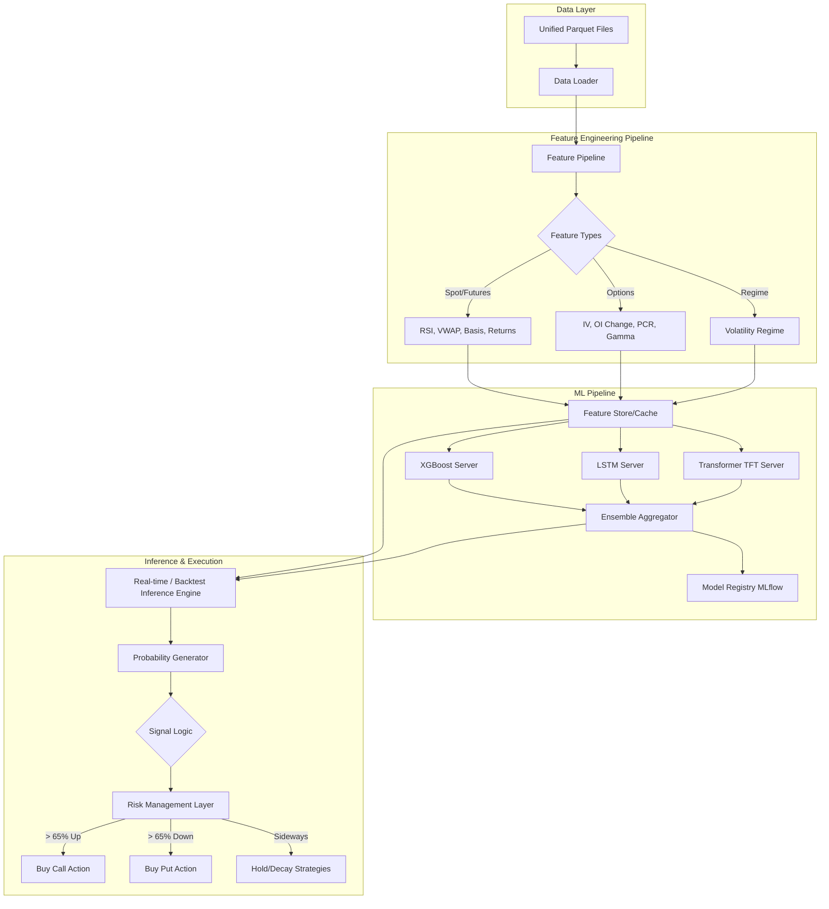

# System Architecture: Short-Term Option Price Predictor

This document outlines the architectural design for the ML-powered short-term (5-15 min) prediction system, integrating seamlessly with the existing NiftyQuant platform.

## High-Level Architecture Diagram

## Component Breakdown

### 1. Data Layer (Leveraging Unified Format)
The foundation is the recently optimized `DataLoader` targeting `parquet_unified`.
*   **Component:** `backend.data_engine.loader.DataLoader`
*   **Function:** Loads the unified parquet file containing Spot, Futures, and all Option strikes for a given expiry.
*   **Optimization:** Data for a specific timestamp can be instantly extracted as cross-sectional slices without expensive joins.

### 2. Feature Engineering Pipeline
A dedicated module to transform raw unified data into ML-ready tensors.
*   **Component:** `backend.ml_engine.features.Builder`
*   **Polars Native:** All transformations must be written in Polars for maximum speed, as this will run on millions of rows during backtesting.
*   **Rolling Aggregations:** Utilizing Polars `rolling` windows to calculate 5-min, 15-min, and 60-min momentum, VWAP distances, and OI velocity.

### 3. Model Pipeline & Registry (Ensemble Approach)
The training and storage subsystem combines multiple model architectures.
*   **Component:** `backend.ml_engine.models`
*   **Algorithms:**
    *   **XGBoost / LightGBM:** Fast, tabular baseline for immediate cross-sectional data.
    *   **LSTM:** For 60-minute historical sequence capture.
    *   **Temporal Fusion Transformer (TFT):** For advanced long-dependency temporal modeling.
*   **Model Registry (MLflow):** Saving trained model weights and versions systematically.

### 4. Inference Engine & Risk Management Layer
The core execution brain bridging ML models with execution engines.
*   **Component:** `backend.ml_engine.inference.Predictor`
*   **Input:** Live feature vector via fast message bus or shared memory.
*   **Ensemble Output:** A weighted probability distribution (e.g., `{"UP": 0.64, "DOWN": 0.22, "SIDEWAYS": 0.14}`).
*   **Risk Layer:** Before triggering a strategy, validates against hard limits: 
    *   Max loss per day limits.
    *   10% option premium stop loss limits.
    *   Max trades per day limits.

### 5. Integration with Adaptive Backtester
The generated signals feed directly into the existing Strategy Engine.
*   Instead of static entry rules (e.g., Time == 09:30), the strategy triggers entries dynamically based on the ML probabilities.
*   **Example Integration:** A new strategy type `MLDirectionalStrategy` inherits from the base strategy class and subscribes to the Inference Engine's tick-by-tick probabilities.

## Technology Stack Extensions
*   **Machine Learning:** `xgboost` / `lightgbm` (Tree-based), `torch` / `tensorflow` (Deep Learning).
*   **Model Registry & Tracking:** `mlflow`.
*   **Real-time Streaming:** `kafka` (for order flow), `redis` (for sub-millisecond feature caching).
*   **Deployment & Ops:** Docker, Kubernetes (for live market deployment latency < 500ms).
